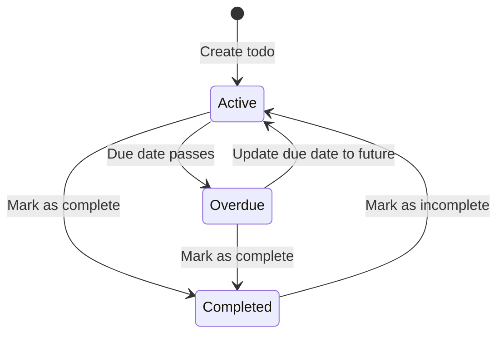
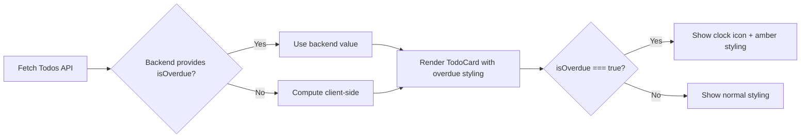

# Data Model: Overdue Todo Items

**Feature**: 001-overdue-todo-items  
**Date**: 2026-05-27  
**Status**: Complete

## Overview

This document defines the data model for the overdue todo items feature. The feature introduces a **computed property** (`isOverdue`) based on existing todo attributes without requiring database schema changes.

---

## Entities

### 1. Todo (Existing Entity - Enhanced)

**Description**: Represents a single todo item with optional due date and completion status. The `isOverdue` property is computed dynamically based on the due date.

#### Attributes

| Attribute | Type | Constraints | Description | Changes |
|-----------|------|-------------|-------------|---------|
| `id` | Integer | Primary Key, Auto-increment, NOT NULL | Unique identifier for the todo | No change |
| `title` | String | NOT NULL, Max 255 chars | The todo item's title/description | No change |
| `dueDate` | ISO Date String | Nullable | Due date in ISO 8601 format (e.g., "2026-05-27") | No change |
| `completed` | Boolean | NOT NULL, Default: false | Whether the todo is completed | No change |
| `createdAt` | Timestamp | NOT NULL, Default: CURRENT_TIMESTAMP | When the todo was created | No change |
| **`isOverdue`** | **Boolean** | **Computed** | **Whether the todo is overdue (due date < today, ignoring time)** | **NEW (computed)** |

#### Validation Rules

| Rule | Validation | Error Message |
|------|------------|---------------|
| Title Required | `title` must be non-empty string | "Todo title is required" |
| Title Length | `title.length <= 255` | "Todo title must not exceed 255 characters" |
| Due Date Format | If provided, `dueDate` must be valid ISO 8601 date string | "Invalid due date format" |
| Due Date Nullability | `dueDate` can be `null` (todos without deadlines) | N/A |

#### State Transitions



**State Definitions**:
- **Active**: Todo is incomplete and either has no due date or due date is today or in the future
- **Overdue**: Todo is incomplete and due date is in the past (before today)
- **Completed**: Todo is marked as done (completion status takes precedence over overdue status)

#### Computed Property: `isOverdue`

**Calculation Logic**:
```javascript
function isOverdue(todo) {
  // Completed todos are never displayed as overdue
  if (todo.completed) return false;
  
  // Todos without due dates cannot be overdue
  if (!todo.dueDate) return false;
  
  // Date-only comparison (ignore time)
  const today = new Date();
  today.setHours(0, 0, 0, 0);
  
  const due = new Date(todo.dueDate);
  due.setHours(0, 0, 0, 0);
  
  return due < today;
}
```

**Computation Rules**:
1. If `completed === true`, return `false` (completed status takes precedence)
2. If `dueDate === null`, return `false` (no deadline means cannot be overdue)
3. If `dueDate` (normalized to midnight) < today (normalized to midnight), return `true`
4. Otherwise, return `false`

**Where Computed**:
- **Backend (recommended)**: Computed in `todoService.js` when fetching todos (consistent across all clients)
- **Frontend (optional fallback)**: Computed in React components for real-time updates if backend doesn't provide it

**Why Not Stored in Database**:
- **Time-sensitive**: Overdue status changes daily at midnight without user action
- **Derived data**: Can be calculated from existing `dueDate` and current date
- **Simplicity**: Avoids scheduled jobs or triggers to update stored overdue flags

---

## Relationships

No relationships are modified or added by this feature. The Todo entity remains standalone.

---

## Database Schema

### Existing Schema (No Changes Required)

```sql
CREATE TABLE IF NOT EXISTS todos (
  id INTEGER PRIMARY KEY AUTOINCREMENT,
  title TEXT NOT NULL CHECK(length(title) <= 255),
  dueDate TEXT,  -- ISO 8601 date string (e.g., "2026-05-27")
  completed INTEGER NOT NULL DEFAULT 0,  -- SQLite uses 0/1 for boolean
  createdAt TEXT NOT NULL DEFAULT CURRENT_TIMESTAMP
);
```

**No schema migration needed** - the `isOverdue` property is computed at runtime.

---

## API Response Model

### Enhanced Todo Response (with computed `isOverdue`)

When fetching todos from the API, the backend **may optionally** include the computed `isOverdue` field:

```json
{
  "id": 1,
  "title": "Submit report",
  "dueDate": "2026-05-26",
  "completed": false,
  "createdAt": "2026-05-20T10:30:00Z",
  "isOverdue": true
}
```

**Frontend Behavior**:
- If backend provides `isOverdue`, use it directly
- If backend doesn't provide `isOverdue`, compute it client-side using the same logic

**Recommendation**: Compute in backend for consistency, but frontend can serve as fallback.

---

## Edge Cases & Handling

| Edge Case | Expected Behavior | Rationale |
|-----------|-------------------|-----------|
| **Todo with no due date** | `isOverdue = false` | Cannot be overdue without a deadline |
| **Completed overdue todo** | `isOverdue = false` (for display purposes) | Completed status takes precedence; overdue styling not shown |
| **Due date is today** | `isOverdue = false` | Becomes overdue at 00:00:00 tomorrow (date-only comparison) |
| **Invalid due date string** | `isOverdue = false` | Defensive programming; treat as no due date |
| **Null/undefined todo** | `isOverdue = false` | Defensive programming; safe default |
| **Future due date** | `isOverdue = false` | Not overdue until due date has passed |
| **Due date in different timezone** | Uses local system timezone | Consistent with existing date handling |

---

## Frontend Data Flow



---

## Testing Considerations

### Unit Tests (Backend)
- Test `isOverdue` computation for all edge cases (null, past, present, future dates)
- Test completed todos with past due dates (should return `false` for display)
- Test date normalization (ensure time component is ignored)

### Unit Tests (Frontend)
- Test TodoCard rendering with `isOverdue = true` vs. `false`
- Test accessibility (clock icon has `aria-label`, color contrast meets WCAG AA)
- Test real-time updates when due date changes

### Integration Tests
- Test API response includes computed `isOverdue` field (if implemented in backend)
- Test end-to-end user scenario: create todo with past due date, verify overdue styling appears

---

## Summary

| Aspect | Details |
|--------|---------|
| **Entities Modified** | Todo (enhanced with computed `isOverdue` property) |
| **Database Changes** | None (computed property only) |
| **Computation Location** | Backend (recommended) or Frontend (fallback) |
| **Performance Impact** | Minimal (O(1) date comparison per todo) |
| **State Transitions** | Active ↔ Overdue ↔ Completed |
| **Edge Case Handling** | Null-safe, completed status precedence, date-only comparison |

---

## References

- Feature Specification: [spec.md](spec.md)
- Research Document: [research.md](research.md)
- Backend Todo Service: `/packages/backend/src/services/todoService.js`
- Frontend TodoCard Component: `/packages/frontend/src/components/TodoCard.js`
