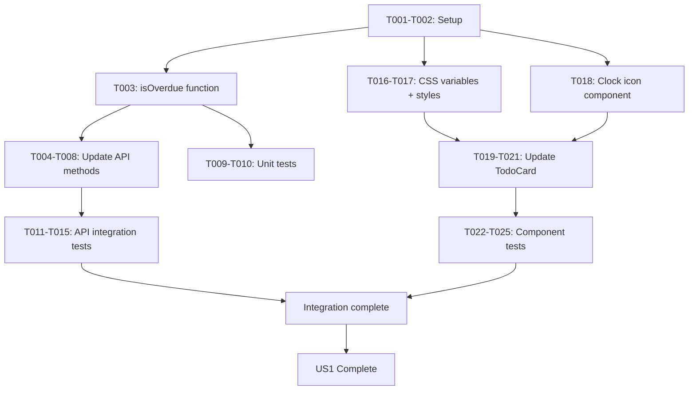

# Tasks: Overdue Todo Items

**Feature**: 001-overdue-todo-items  
**Date**: 2026-05-27  
**Branch**: `001-overdue-todo-items`

**Input**: Design documents from `/specs/001-overdue-todo-items/`

**Prerequisites**: plan.md, spec.md, research.md, data-model.md, contracts/api-contract.md

**Tests**: Included (TDD approach with 80% minimum coverage per constitutional requirement)

**Organization**: Tasks are grouped by user story to enable independent implementation and testing of each story.

## Format: `- [ ] [ID] [P?] [Story?] Description`

- **[P]**: Can run in parallel (different files, no dependencies)
- **[Story]**: Which user story this task belongs to (e.g., US1, US2, US3)
- Include exact file paths in descriptions

---

## Phase 1: Setup

**Purpose**: Project initialization (minimal - project already exists)

- [X] T001 Verify project dependencies are installed and up-to-date in packages/backend/package.json and packages/frontend/package.json
- [X] T002 Verify Jest configuration supports fake timers in packages/backend/jest.config.js

---

## Phase 2: Foundational

**Purpose**: Core infrastructure that MUST be complete before ANY user story can be implemented

**⚠️ NOTE**: No foundational blockers for this feature - the todo system with due dates already exists

**Checkpoint**: Foundation ready - user story implementation can now begin

---

## Phase 3: User Story 1 - Visual Identification of Overdue Tasks (Priority: P1) 🎯 MVP

**Goal**: Users can immediately identify overdue tasks through orange/amber color styling and clock icon, without manually comparing due dates against today.

**Independent Test**: Create a todo with a past due date and verify it displays with distinctive visual styling (amber color + clock icon) in the todo list.

### Backend Implementation - Computed Property (User Story 1)

- [X] T003 [P] [US1] Add isOverdue() helper function to packages/backend/src/services/todoService.js (date-only comparison logic)
- [X] T004 [US1] Update getAllTodos() method in packages/backend/src/services/todoService.js to include computed isOverdue field
- [X] T005 [US1] Update getTodoById() method in packages/backend/src/services/todoService.js to include computed isOverdue field
- [X] T006 [US1] Update createTodo() method in packages/backend/src/services/todoService.js to include computed isOverdue field
- [X] T007 [US1] Update updateTodo() method in packages/backend/src/services/todoService.js to include computed isOverdue field
- [X] T008 [US1] Update toggleTodo() method in packages/backend/src/services/todoService.js to include computed isOverdue field

### Backend Tests - Unit Tests (User Story 1)

- [X] T009 [P] [US1] Write unit tests for isOverdue() function in packages/backend/__tests__/services/todoService.test.js (edge cases: null, past, present, future, completed)
- [X] T010 [P] [US1] Write unit tests for getAllTodos() with isOverdue field in packages/backend/__tests__/services/todoService.test.js

### Backend Tests - API Integration (User Story 1)

- [X] T011 [P] [US1] Write API integration test for GET /api/todos with isOverdue field in packages/backend/__tests__/app.test.js
- [X] T012 [P] [US1] Write API integration test for GET /api/todos/:id with isOverdue field in packages/backend/__tests__/app.test.js
- [X] T013 [P] [US1] Write API integration test for POST /api/todos with isOverdue field in packages/backend/__tests__/app.test.js
- [X] T014 [P] [US1] Write API integration test for PUT /api/todos/:id with isOverdue field in packages/backend/__tests__/app.test.js
- [X] T015 [P] [US1] Write API integration test for PATCH /api/todos/:id/toggle with isOverdue field in packages/backend/__tests__/app.test.js

### Frontend Implementation - Visual Styling (User Story 1)

- [X] T016 [P] [US1] Add overdue CSS variables (--overdue-text, --overdue-bg, --overdue-border) to packages/frontend/src/styles/theme.css for light and dark modes
- [X] T017 [P] [US1] Add overdue class styles (.todo-card.overdue) to packages/frontend/src/App.css or component-specific CSS
- [X] T018 [P] [US1] Add clock icon SVG component or import from icon library in packages/frontend/src/components/ (e.g., ClockIcon.js or use existing icon library)
- [X] T019 [US1] Update TodoCard component in packages/frontend/src/components/TodoCard.js to display clock icon when isOverdue is true
- [X] T020 [US1] Update TodoCard component in packages/frontend/src/components/TodoCard.js to apply overdue styling (amber color + overdue class) when isOverdue is true
- [X] T021 [US1] Add ARIA label to clock icon in packages/frontend/src/components/TodoCard.js for screen reader accessibility

### Frontend Tests - Component Tests (User Story 1)

- [X] T022 [P] [US1] Write TodoCard test for overdue todo rendering in packages/frontend/src/components/__tests__/TodoCard.test.js (verify clock icon and amber styling appear)
- [X] T023 [P] [US1] Write TodoCard test for non-overdue todo rendering in packages/frontend/src/components/__tests__/TodoCard.test.js (verify no overdue styling)
- [X] T024 [P] [US1] Write TodoCard test for completed overdue todo in packages/frontend/src/components/__tests__/TodoCard.test.js (verify overdue styling does not appear)
- [X] T025 [P] [US1] Write TodoCard test for accessibility in packages/frontend/src/components/__tests__/TodoCard.test.js (verify ARIA labels, color contrast via axe-core or manual check)

**Checkpoint**: User Story 1 complete - overdue todos display with visual indicators

---

## Phase 4: User Story 2 - Overdue Status Without Due Date Handling (Priority: P2)

**Goal**: Users understand that todos without due dates cannot be overdue, maintaining clarity in the overdue indicator system.

**Independent Test**: Create todos without due dates and verify they never display overdue styling, regardless of when they were created.

### Validation & Testing (User Story 2)

- [X] T026 [P] [US2] Write backend unit test in packages/backend/__tests__/services/todoService.test.js verifying isOverdue() returns false for todos with null dueDate
- [X] T027 [P] [US2] Write API integration test in packages/backend/__tests__/app.test.js verifying GET /api/todos returns isOverdue: false for todos without due dates
- [X] T028 [P] [US2] Write frontend component test in packages/frontend/src/components/__tests__/TodoCard.test.js verifying todos without due dates never show overdue styling

**Checkpoint**: User Story 2 complete - null due date handling verified

---

## Phase 5: User Story 3 - Real-time Overdue Status Updates (Priority: P3)

**Goal**: Users see overdue status update automatically as they interact with the application, without needing to refresh or reload the page.

**Independent Test**: Keep the application open and observe that todos automatically update their overdue status when due dates are modified.

### Real-time Update Testing (User Story 3)

- [X] T029 [P] [US3] Write API integration test in packages/backend/__tests__/app.test.js verifying PUT /api/todos/:id returns updated isOverdue when due date changes from future to past
- [X] T030 [P] [US3] Write API integration test in packages/backend/__tests__/app.test.js verifying PUT /api/todos/:id returns updated isOverdue when due date changes from past to future
- [X] T031 [P] [US3] Write frontend integration test in packages/frontend/src/__tests__/App.test.js verifying TodoCard updates overdue styling after due date modification (using msw to mock API)
- [X] T032 [P] [US3] Write frontend integration test in packages/frontend/src/__tests__/App.test.js verifying PATCH /api/todos/:id/toggle updates isOverdue when completed status changes

**Checkpoint**: User Story 3 complete - real-time updates verified

---

## Phase 6: Polish & Cross-Cutting Concerns

**Purpose**: Final improvements and validation

- [X] T033 [P] Run all backend tests with coverage report: npm test -- --coverage in packages/backend
- [X] T034 [P] Run all frontend tests with coverage report: npm test -- --coverage in packages/frontend
- [X] T035 Verify 80% minimum test coverage for modified files in both backend and frontend
- [X] T036 Manual accessibility testing: verify WCAG AA color contrast (Amber 500 on light/dark backgrounds) using browser DevTools or online tool
- [ ] T037 Manual cross-browser testing: verify overdue styling in Chrome, Firefox, Safari
- [ ] T038 Run quickstart validation from specs/001-overdue-todo-items/quickstart.md (create todos with past/present/future dates, verify visual indicators)
- [X] T039 Code review: verify constitutional compliance (code quality, simplicity, no duplication)
- [X] T040 Update documentation if needed: verify specs/001-overdue-todo-items/README.md or project docs reflect new overdue feature

---

## Dependencies & Execution Order

### Phase Dependencies

- **Setup (Phase 1)**: No dependencies - can start immediately
- **Foundational (Phase 2)**: No blocking tasks - existing todo system is sufficient
- **User Story 1 (Phase 3)**: Can start immediately (no external dependencies)
  - Backend implementation and tests can proceed in parallel
  - Frontend depends on backend completion for integration testing (but can develop against mocks)
- **User Story 2 (Phase 4)**: Depends on User Story 1 backend isOverdue() function (T003) being complete
- **User Story 3 (Phase 5)**: Depends on User Story 1 implementation (T003-T021) being complete
- **Polish (Phase 6)**: Depends on all user stories being complete

### User Story Dependencies

- **User Story 1 (P1)**: Independent - no dependencies on other user stories
- **User Story 2 (P2)**: Lightweight validation of US1 - can run in parallel with US3 once US1 backend is done
- **User Story 3 (P3)**: Validation of US1 real-time behavior - can run in parallel with US2 once US1 is done

### Within User Story 1 (Main Implementation)

**Backend Flow**:
1. T003 (isOverdue helper) MUST complete first
2. T004-T008 (update all methods) can run in parallel after T003
3. T009-T015 (tests) can be written in parallel with implementation (TDD approach) or after

**Frontend Flow**:
1. T016-T018 (CSS + icon) can run in parallel
2. T019-T021 (TodoCard updates) depend on T016-T018 being complete
3. T022-T025 (component tests) can be written alongside T019-T021 (TDD) or after

**Cross-Stack**:
- Frontend can start in parallel with backend by mocking API responses with isOverdue field
- Full integration testing (T031-T032) requires backend completion

### Parallel Opportunities

**Maximum Parallelism** (if team has 5+ developers):
1. **Developer 1**: Backend isOverdue logic (T003-T008)
2. **Developer 2**: Backend tests (T009-T015) - pair with Dev 1 for TDD
3. **Developer 3**: Frontend CSS + icon (T016-T018)
4. **Developer 4**: Frontend TodoCard updates (T019-T021)
5. **Developer 5**: Frontend tests (T022-T025) - pair with Dev 4 for TDD

**Typical Parallelism** (2-3 developers):
1. **Backend Developer**: T003-T015 (backend implementation + tests)
2. **Frontend Developer**: T016-T025 (frontend implementation + tests, using mocked API)
3. Integration testing (T031-T032) after both complete

**Solo Developer** (sequential):
1. T001-T002 (setup)
2. T003-T010 (backend core + unit tests)
3. T011-T015 (backend API tests)
4. T016-T021 (frontend implementation)
5. T022-T025 (frontend tests)
6. T026-T032 (validation tests for US2 & US3)
7. T033-T040 (polish)

---

## Parallel Execution Example: User Story 1

---

## Implementation Strategy

### MVP Scope (Minimum Viable Product)
- **User Story 1 only** (Phase 3): Core overdue visual indicators
- Delivers immediate value: users can spot overdue todos at a glance
- Estimated: 8-12 hours for solo developer with TDD

### Full Feature Scope
- **All user stories** (Phase 3-5): Complete overdue feature with validation
- Includes edge case testing and real-time update verification
- Estimated: 12-16 hours for solo developer with comprehensive tests

### Incremental Delivery
1. **Week 1**: User Story 1 backend (T003-T015) → Deploy backend API with isOverdue field
2. **Week 1-2**: User Story 1 frontend (T016-T025) → Deploy visual indicators
3. **Week 2**: User Stories 2-3 validation (T026-T032) → Verify edge cases
4. **Week 2**: Polish (T033-T040) → Quality assurance and documentation

---

## Testing Summary

### Test Coverage Targets
- **Backend**: 80% minimum coverage for todoService.js (constitutional requirement)
- **Frontend**: 80% minimum coverage for TodoCard.js
- **Integration**: All 5 API endpoints tested with overdue scenarios

### Test Categories
| Category | Task IDs | File Count | Focus |
|----------|----------|------------|-------|
| Backend Unit Tests | T009-T010 | 1 file | isOverdue logic edge cases |
| Backend API Tests | T011-T015 | 1 file | API contract compliance |
| Frontend Component Tests | T022-T025 | 1 file | TodoCard overdue rendering |
| Validation Tests (US2) | T026-T028 | 3 files | Null due date handling |
| Validation Tests (US3) | T029-T032 | 2 files | Real-time updates |

### Testing Approach
- **TDD**: Write tests first (T009-T015 before implementation, T022-T025 before UI changes)
- **Jest Fake Timers**: Use jest.useFakeTimers() and jest.setSystemTime() for deterministic date testing
- **Mocking**: Use msw (Mock Service Worker) for frontend API mocking during development
- **Accessibility**: Validate WCAG AA compliance with axe-core or manual testing

---

## Summary

- **Total Tasks**: 40 tasks
- **Setup**: 2 tasks
- **Foundational**: 0 tasks (no blockers)
- **User Story 1 (P1)**: 23 tasks (backend + frontend + tests)
- **User Story 2 (P2)**: 3 tasks (validation tests)
- **User Story 3 (P3)**: 4 tasks (real-time update tests)
- **Polish**: 8 tasks (coverage, accessibility, documentation)

### Task Distribution by Type
- **Implementation**: 17 tasks (42.5%)
- **Testing**: 20 tasks (50%)
- **Validation/Polish**: 3 tasks (7.5%)

### Parallel Opportunities
- **Setup phase**: 2 tasks can run sequentially (quick)
- **User Story 1 backend**: 6 implementation + 7 test tasks (many parallel opportunities)
- **User Story 1 frontend**: 6 implementation + 4 test tasks (parallel with backend if using mocks)
- **User Stories 2-3**: 7 validation tasks (all can run in parallel once US1 complete)

### Suggested MVP Scope
- **Phase 1-3 only**: Setup + User Story 1 (25 tasks)
- Delivers core value: visual overdue indicators
- User Stories 2-3 are validation/enhancement, can be deferred if time-constrained

### Constitutional Compliance
- ✅ TDD approach with 80% coverage requirement
- ✅ Accessibility (WCAG AA) built-in from start
- ✅ Simple, maintainable implementation (no over-engineering)
- ✅ Monorepo structure preserved
- ✅ Error handling for edge cases (null dates, completed todos)
